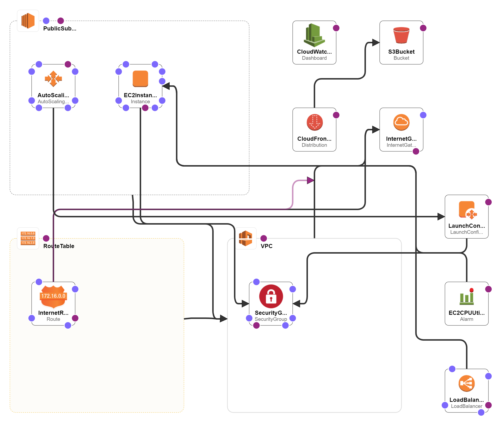

Certamente! Aqui está o README atualizado com as marcações Markdown e a descrição dos recursos e serviços da AWS utilizados:

# AWS CloudFormation - Monitoramento de Site com AWS CloudWatch

Este repositório contém as configurações do AWS CloudFormation para provisionar um site estático na AWS e configurar o monitoramento utilizando o serviço AWS CloudWatch.

## Visão geral

O objetivo deste projeto é criar uma infraestrutura na AWS para hospedar um site estático e configurar o monitoramento contínuo das instâncias EC2 utilizadas. O provisionamento da infraestrutura é feito por meio do AWS CloudFormation, enquanto o monitoramento é configurado com o AWS CloudWatch.

## Recursos incluídos




- **VPC (Virtual Private Cloud):** Isola os recursos da AWS e permite controlar a rede virtual, incluindo o endereço IP e a configuração de sub-redes.

- **Subnet pública:** Fornece conectividade à Internet para as instâncias EC2 e outros recursos da rede.

- **Gateway de Internet:** Permite a comunicação das instâncias EC2 com a Internet.

- **Anexo do Gateway de Internet à VPC:** Conecta o Gateway de Internet à VPC para permitir o acesso à Internet.

- **Tabela de rotas:** Define as regras para rotear o tráfego dentro da VPC.

- **Associação da Subnet à Tabela de Rotas:** Define qual sub-rede está associada a qual tabela de rotas.

- **Rota para acesso à Internet:** Permite que as instâncias EC2 acessem a Internet.

- **Security Group:** Controla o tráfego de entrada e saída para as instâncias EC2.

- **Instância EC2:** Hospeda o site estático e executa outras tarefas, como o monitoramento.

- **Auto Scaling Group:** Ajusta automaticamente a capacidade da instância EC2 de acordo com a demanda.

- **Launch Configuration:** Configura as instâncias EC2 no Auto Scaling Group.

- **Load Balancer:** Distribui o tráfego entre as instâncias EC2 para aumentar a disponibilidade e escalabilidade.

- **Bucket S3:** Armazena os arquivos estáticos do site.

- **Distribuição CloudFront:** Acelera a entrega de conteúdo estático através de uma rede de entrega de conteúdo global.

- **Alarme CloudWatch:** Monitora a utilização da CPU na instância EC2 e dispara alarmes com base em métricas definidas.

- **Painel CloudWatch:** Permite visualizar métricas em tempo real e configurar alarmes personalizados.

## Pré-requisitos

Antes de executar o AWS CloudFormation, certifique-se de ter os seguintes pré-requisitos configurados:

- Uma conta na AWS com permissões suficientes para criar os recursos especificados.
- Acesso à AWS Management Console ou ao AWS CLI para executar o AWS CloudFormation.
- Um par de chaves SSH para acesso à instância EC2, caso seja necessário.

## Como usar

1. Faça o clone deste repositório para o seu ambiente local:

```markdown
git clone <URL_DO_REPOSITORIO>
```

2. Acesse o AWS Management Console ou use o AWS CLI para criar uma pilha do AWS CloudFormation a partir do arquivo `template.yaml` fornecido neste repositório.

3. Siga as etapas fornecidas pelo AWS CloudFormation para

 configurar os parâmetros necessários, como nome da pilha, nome do bucket S3, etc.

4. Aguarde a conclusão do provisionamento da infraestrutura. Isso pode levar alguns minutos.

5. Após a conclusão, você receberá as informações sobre os recursos criados, incluindo a URL do site estático hospedado.

## Personalização

- Caso queira alterar o conteúdo do site, basta adicionar ou modificar os arquivos no bucket S3 criado durante o provisionamento.

- Para configurar alarmes personalizados no CloudWatch, acesse o painel do CloudWatch no AWS Management Console e defina as métricas e condições desejadas.

- Este README é apenas um exemplo e pode ser personalizado de acordo com as necessidades e especificidades do seu projeto.

## Contribuição

Contribuições são bem-vindas! Se você tiver alguma melhoria, adição de recursos ou correção de problemas, fique à vontade para enviar um pull request.

## Licença

Este projeto está licenciado sob a [MIT License](LICENSE).

---

Este README é apenas um exemplo e pode ser personalizado de acordo com as necessidades e especificidades do seu projeto.